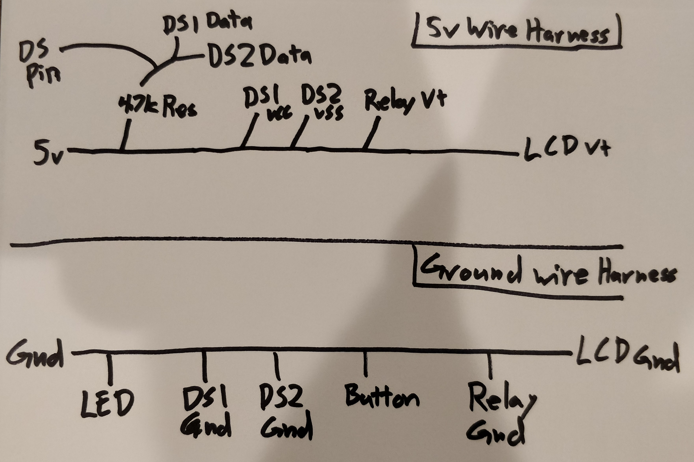
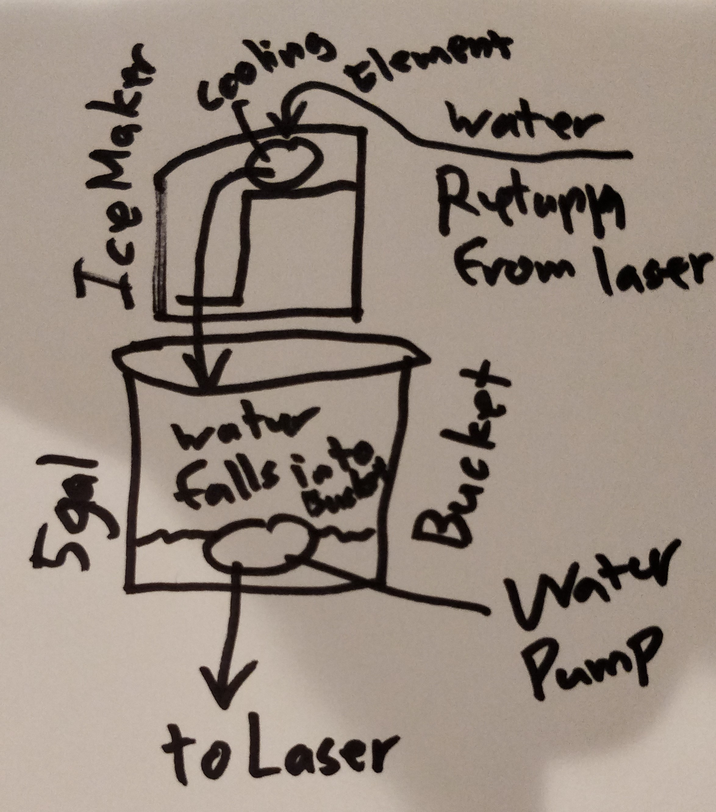

# Build Instructions

# Prep the Ice Maker
The main thing here, is the ice maker has a compressor that connects to a fixture that will freeze.  We want the water to run across this to cool down, and we want to control when it is freezing and when it is not to maintain the temperature.  While the actual device may vary, it would be something along these lines.
> WARNING: I leave it up to you to be smart and safe about how you do this.  There are electrical components and you can easily hurt yourself if you're not careful!

1. Remove the Back Casing of the ice maker.
1. Disconnect all the wires from the control board.
1. Optional - Remove unnecessary components to clean it up a bit
    * On my particular model, I had some switches, motors, sensors and control panels I was able to remove to make more space and make it cleaner.
1. The compressor on mine ran off straight 110V power (traces on the control board showed it was a simple relay to turn it on or off).  Take the the common wire of the compressor and power cord and connect them together.
1. Make 2 extension cables for the hot side of the power cable and compressor, these will connect to the relay we will control.  I used a thicker cable to better handle the current of the compressor.
1. Make 2 extension cables for the fan that helps cool the compressor.  These will connect the fan to another relay and to the ground so we can turn it on and off as needed.

# Build the Circuit
1. Because multiple components need Ground, and the 5v rail, I made 2 wire harnesses, 1 for ground, 1 for 5V.  Use this schematic:

1. I also added heat shrink tubing to all of the joints to help protect the bare wires from accidental shorts.
1. Connect all the components as appropriate.  The pins on the wire harnesses, buttons, leds, etc I leave to you to map out based on the code and your setup.
1. Here are some connections that may not be so obvious:
    * Arduino Ground to the Compressor Fan Ground.
    * Arduino VCC to the relay that turns the fan on and off.  The fan on mine was 12v, and I have a 12v plug, so vcc will be 12v, prefect!
    * Connect the compressor hot and power cord hot to the relay for the compressor.
    * Connect the relay control pins (on mine they were some of the only pins not in the harnesses above.)

# Load the Code
1. Flash the Arduino with the code.
1. Attach the serial monitor.
1. Note the Addresses of the DS18B20
1. Update the code with the IDs for your DS18B20 devices.
1. Update the Arduino.

# Determine which DS18B20 is which
With the Arduino running, hold your hand over 1 of the DS18B20 sensors.  Notice which one's temp goes up on the LCD.  That is the one in your hand.

# Stack it and Run.
I stacked mine together as such:

I plan on using enough water to make the temperature swings slow down, but not so much the ice maker can't keep up.  I'm guesstimating 3ish gallons of water.